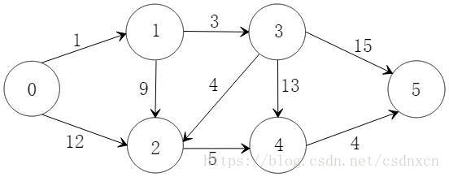
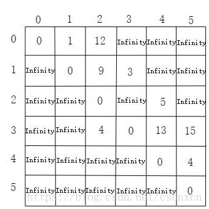
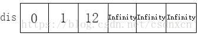
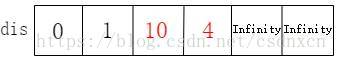
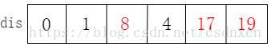
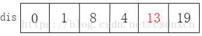
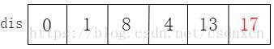

# dijkstra算法

## 什么是dijkstra算法和Dijkstra算法的作用

指定一个点到其他各个顶点的最短路径，叫做：单源最短路径。dijkstra算法就是为了
解决这个问题的算法 

## 分析过程

### 数据结构

二维数组

### 求解过程

dijkstra是“单源最短路径”，在讲解求解过程之前，我们就选择0号顶点作为源点。

此时我们称dis数组为最短路的“估计值”。

既然是求0号顶点到其他顶点的最短距离，那我们首先根据dis数组，找出当前距离0号顶点最近的一个顶点，
我们可以找到1号顶点距离0号顶点最近。此时，我们就可以确定0号顶点到1号顶点最短距离。
也就是说dis[1]从估计值变成了确定值。
这个时候你可能会想为什么？
我们可以这样思考，找最短路径的途径就是看能不能找到中转点从而减少距离，
由于我们取得是dis中的最小值，那么不可能再找到中转点从而减少0到1的距离。

既然我们已经确认了0号到1号的最短距离，这个时候我们就去更新我们的dis数组，如何更新呢？
我们可以把1号顶点作为中转点，通过查看初始矩阵path，通过比较
`dis[1] + path[1][i]`和dis[i]的大小来决定是否更新dis[i]。更新结束之后，我们得到 

更新完dis之后，依据更新的dis，从未确定距离的点中选出距离最短的那个，这个距离就变成了确定值，
紧接着去更新dis数组。得到：

重复上面的步骤依次得到更新

最后一张图就是最后的结果

