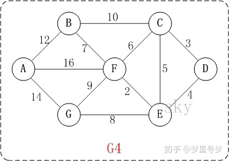

# dijkstra算法

迪杰斯特拉(Dijkstra)算法是典型最短路径算法，用于计算一个节点到其他节点的最短路径。
它的主要特点是以起始点为中心向外层层扩展(广度优先搜索思想)，直到扩展到终点为止。

## 基本思想

通过Dijkstra计算图G中的最短路径时，需要指定起点s(即从顶点s开始计算)。
此外，引进两个集合S和U。S的作用是记录已求出最短路径的顶点(以及相应的最短路径长度)，而U则是记录还未求出最短路径的顶点(以及该顶点到起点s的距离)。
初始时，S中只有起点s；U中是除s之外的顶点，并且U中顶点的路径是”起点s到该顶点的路径”。然后，从U中找出路径最短的顶点，并将其加入到S中；
接着，更新U中的顶点和顶点对应的路径。 然后，再从U中找出路径最短的顶点，并将其加入到S中；
接着，更新U中的顶点和顶点对应的路径。 重复该操作，直到遍历完所有顶点。

## 操作步骤

初始时，S只包含起点s；U包含除s外的其他顶点，且U中顶点的距离为”起点s到该顶点的距离”
[例如，U中顶点v的距离为(s,v)的长度，然后s和v不相邻，则v的距离为∞]。
从U中选出”距离最短的顶点k”，并将顶点k加入到S中；同时，从U中移除顶点k。
更新U中各个顶点到起点s的距离。之所以更新U中顶点的距离，是由于上一步中确定了k是求出最短路径的顶点，
从而可以利用k来更新其它顶点的距离；例如，(s,v)的距离可能大于(s,k)+(k,v)的距离。
重复步骤(2)和(3)，直到遍历完所有顶点。
单纯的看上面的理论可能比较难以理解，下面通过实例来对该算法进行说明。以D为开头，求D到各个点的最短距离。

第1步：初始化距离，其实指与D直接连接的点的距离。dis[c]代表D到C点的最短距离，因而初始dis[C]=3，dis[E]=4，dis[D]=0，其余为无穷大。
设置集合S用来表示已经找到的最短路径。此时，S={D}。现在得到D到各点距离{D(0)，C(3)，E（4），F（*），G（*），B（*），A(*)}，
其中*代表未知数也可以说是无穷大，括号里面的数值代表D点到该点的最短距离。

第2步：不考虑集合S中的值，因为dis[C]=3，是当中距离最短的，所以此时更新S，S={D,C}。接着我们看与C连接的点，分别有B，E，F，已经在集合S中的不看，
dis[C-B]=10，因而dis[B]=dis[C]+10=13，dis[F]=dis[C]+dis[C-F]=9，dis[E]=dis[C]+dis[C-E]=3+5=8>4(初始化时的dis[E]=4)不更新。
此时{D(0)，C(3)，E（4），F（9），G（*），B（13），A(*)}。

第3步：在第2步中，E点的值4最小，更新S={D，C，E}，此时看与E点直接连接的点，分别有F，G。dis[F]=dis[E]+dis[E-F]=4+2=6（比原来的值小，得到更新），dis[G]=dis[E]+dis[E-G]=4+8=12（更新）。此时{D(0)，C(3)，E（4），F（6），G（12），B（13），A(*)}。

第4步：在第3步中，F点的值6最小，更新S={D，C，E，F}，此时看与F点直接连接的点，分别有B，A，G。dis[B]=dis[F]+dis[F-B]=6+7=13，dis[A]=dis[F]+dis[F-A]=6+16=22，dis[G]=dis[F]+dis[F-G]=6+9=15>12（不更新）。此时{D(0)，C(3)，E（4），F（6），G（12），B（13），A(22)}.

第5步：在第4步中，G点的值12最小，更新S={D，C，E，F，G}，此时看与G点直接连接的点，只有A。dis[A]=dis[G]+dis[G-A]=12+14=26>22(不更新)。{D(0)，C(3)，E（4），F（6），G（12），B（13），A(22)}.

第6步：在第5步中，B点的值13最小，更新S={D，C，E，F，G，B}，此时看与B点直接连接的点，只有A。dis[A]=dis[B]+dis[B-A]=13+12=25>22(不更新)。{D(0)，C(3)，E（4），F（6），G（12），B（13），A(22)}.

第6步：最后只剩下A值，直接进入集合S={D，C，E，F，G，B，A}，此时所有的点都已经遍历结束，得到最终结果{D(0)，C(3)，E（4），F（6），G（12），B（13），A(22)}.

