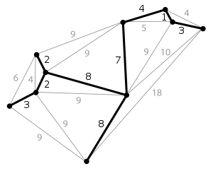

# 综述

最小生成树是一副连通加权无向图中一棵权值最小的生成树。

它在实际中有什么应用呢？比如说有N个城市需要建立互联的通信网路，如何使得需要铺设的通信电缆的总长度最小呢？这就需要用到最小生成树的思想了。

## prim算法

1. 以某一个点开始，寻找当前该点可以访问的所有的边
2. 在已经寻找的边中发现最小边，这个边必须有一个点还没有访问过，将还没有访问的点加入我们的集合，记录添加的边
3. 寻找当前集合可以访问的所有边，重复2的过程，直到没有新的点可以加入
4. 此时由所有边构成的树即为最小生成树

## kruskal算法

假设一个图有m个节点，n条边。首先，我们需要把m个节点看成m个独立的生成树。并且把n条边按照从
小到大的顺序排列。在n条边中，我们依次取出其中的每一条边。
如果发现边的两个节点分别位于两棵树上，那么把两颗树合并为一棵树，
如果边的两个节点位于同一颗树上，那么忽略这条边，继续运行。
等到所有边遍历结束，我们就获得了最小生成树。

## 参考资料

1. 最小生成树的两种算法概述: https://zhuanlan.zhihu.com/p/34922624
